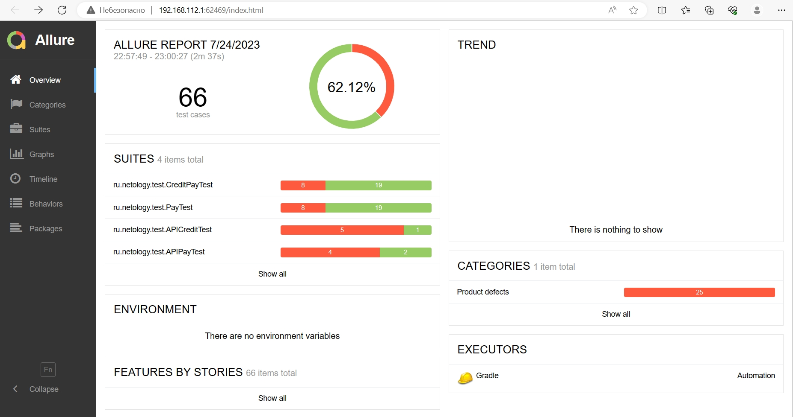

## Отчёт о проведенном тестировании

### Краткое описание

Проведено автоматизированное тестирование комплексного сервиса по покупке тура, взаимодействующего с СУБД и API Банка.

Приложение тестировалось по двум способам оплаты:
* Обычная оплата по дебетовой карте
* Уникальная технология: выдача кредита по данным банковской карты

Само приложение не обрабатывает данные по картам, а пересылает их банковским сервисам:
* сервису платежей
* кредитному сервису

Протестирована поддержка двух СУБД:
* MySQL
* PostgreSQL

**Приложение работает корректно с обеими СУБД.**

### Количество тест-кейсов
Всего выполнено 66 автоматизированных тест-кейсов

### %успешных/не успешных
* 41 успешных – что составляет 62.12 %
* 25 не успешных – что составляет 37.88 %

### Общие рекомендации
* Исправить баги указанные в [issue](https://github.com/fv-andrey/Automation/issues)
* Составить документацию на тестируемое приложение с подробным описанием поведения форм заполнения и сохранения данных в СУБД